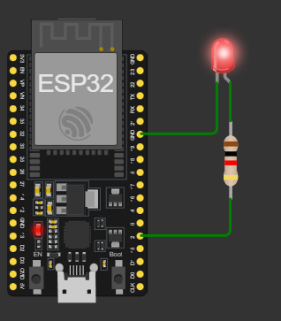

# Tugas Pendahuluan 1

Nama: Sihombing Giovano Geraldo

NPM: 2206059566

---

## 1. Soal 1 <span style="color:red">(20poin)</span>

Dokumentasi per Baris pada Kode

**FOTO RANGKAIAN:**

 

Saya menggunakan LED diluar dari LED_BUILTIN karena belum memiliki ESP. (Wokwi tidak mendukung penggunaan LED_BUILTIN)

**INISIALISASI AWAL**

```c
//Sihombing Giovano Geraldo - 2206059566

#include <Arduino.h> // Import Library Arduino

// Saya belum memiliki ESP32 jadi masih menggunakan LED eksternal di pin 2.
const int ledPin = 2; // Pin GPIO 2 sebagai pin untuk LED bawaan pada ESP32

// Deklarasi handler untuk Task Blinking LED
TaskHandle_t TaskBlinkHandle = NULL; // Deklarasi variabel untuk mengontrol task blinking LED
int blinkInterval = 500; // Interval default untuk blinking LED = 500 ms
```

Bagian kode ini dimulai dengan mengimpor library **Arduino** yang diperlukan agar kode dapat berfungsi pada platform ESP32. LED eksternal  dihubungkan ke pin `GPIO 2`. Selanjutnya, sebuah handler task bernama `TaskBlinkHandle` dideklarasikan dengan nilai awal `NULL`. Handler ini digunakan untuk mengontrol task yang bertanggung jawab atas operasi "blinking" LED. Variabel `blinkInterval`diatur dengan nilai default **500 ms**, yang akan digunakan sebagai interval waktu untuk menghidupkan dan mematikan LED.

**FUNCTION `TaskBlinkingLED`:**

```c
// Fungsi Task untuk Blinking LED
void TaskBlinkingLED(void *pvParameters) {
  pinMode(ledPin, OUTPUT); // Set GPIO 2 sebagai output, dilakukan di dalam task untuk memastikan inisialisasi yang tepat
  while (1) { // Loop utama task
    digitalWrite(ledPin, HIGH);   // Nyalakan LED
    vTaskDelay(pdMS_TO_TICKS(blinkInterval)); // Tunggu selama blinkInterval, konversi milidetik ke ticks
    digitalWrite(ledPin, LOW);    // Matikan LED
    vTaskDelay(pdMS_TO_TICKS(blinkInterval)); // Tunggu selama blinkInterval sebelum memulai siklus kembali
  }
}
```
Fungsi **`TaskBlinkingLED`** akan mengatur proses blinking LED dengan mengonfigurasi **GPIO 2** sebagai output. Di dalam loop utama, LED dinyalakan dengan **`digitalWrite(ledPin, HIGH)`**, lalu task berhenti sementara selama **`blinkInterval`** milidetik yang dikonversi ke ticks menggunakan **`pdMS_TO_TICKS`**. Setelah itu, LED dimatikan dengan **`digitalWrite(ledPin, LOW)`** dan task kembali menunggu sebelum mengulangi siklus nyala-mati LED secara terus-menerus.

**FUNCTION `TaskSerialInput`:**
```c
// Fungsi Task untuk membaca input dari Serial Monitor
void TaskSerialInput(void *pvParameters) {
  String inputString; // Variabel untuk menyimpan input dari serial

  while (1) { // Loop utama task
    if (Serial.available() > 0) { // Jika ada data yang masuk melalui serial
      inputString = Serial.readStringUntil('\n'); // Baca input dari serial hingga menemukan karakter newline ('\n')
      inputString.trim(); // Hilangkan spasi berlebih di awal dan akhir input
      
      // Cek apakah input adalah "resume" untuk melanjutkan task LED yang ditunda
      if (inputString == "resume") {
        if (eTaskGetState(TaskBlinkHandle) == eSuspended) { // Jika task dalam status suspended
          vTaskResume(TaskBlinkHandle); // Resume task blinking LED
          Serial.println("Task Blinking LED resumed."); // Informasikan bahwa task dilanjutkan
        } else {
          Serial.print("Gagal: Task tidak dalam status eSuspended. Status saat ini: ");
          Serial.println(eTaskGetState(TaskBlinkHandle)); // Cetak status task saat ini jika tidak dalam keadaan suspended
        }
      } 
      // Cek apakah input adalah "suspend" untuk menghentikan task LED
      else if (inputString == "suspend") {
        if (eTaskGetState(TaskBlinkHandle) == eRunning || eTaskGetState(TaskBlinkHandle) == eBlocked) { 
          vTaskSuspend(TaskBlinkHandle); // Tunda task jika statusnya running atau blocked
          Serial.println("Task Blinking LED suspended."); // Informasikan bahwa task dihentikan
        } else {
          Serial.print("Gagal: Task tidak dalam status eRunning atau eBlocked. Status saat ini: ");
          Serial.println(eTaskGetState(TaskBlinkHandle)); // Cetak status task jika tidak bisa dihentikan
        }
      }
      // Cek apakah input adalah "delete" untuk menghapus task LED
      else if (inputString == "delete") {
        if (eTaskGetState(TaskBlinkHandle) != eDeleted && TaskBlinkHandle != NULL) { 
          vTaskDelete(TaskBlinkHandle); // Hapus task jika belum dihapus
          TaskBlinkHandle = NULL; // Set handler task ke NULL setelah dihapus
          Serial.println("Task Blinking LED deleted."); // Informasikan bahwa task dihapus
        } else {
          Serial.println("Gagal: Task sudah dihapus atau tidak ada."); // Informasikan jika task sudah dihapus
        }
      } 
      // Jika input berupa angka, gunakan untuk mengubah interval blinking LED
      else {
        int newInterval = inputString.toInt(); // Konversi input ke integer
        if (newInterval >= 0) { // Jika interval valid (>= 0)
          if (TaskBlinkHandle == NULL) { // Jika task belum ada atau sudah dihapus
            blinkInterval = newInterval; // Set interval blinking baru
            xTaskCreate(TaskBlinkingLED, "TaskBlink", 1024, NULL, 1, &TaskBlinkHandle); // Buat task baru untuk blinking LED
            Serial.print("Task Blinking LED dibuat dengan interval: ");
            Serial.print(newInterval);
            Serial.println(" ms."); // Cetak informasi task yang baru dibuat
          } else {
            blinkInterval = newInterval; // Ubah interval blinking jika task masih ada
            Serial.print("Interval diperbarui: ");
            Serial.print(newInterval);
            Serial.println(" ms."); // Cetak informasi interval yang diperbarui
          }
        } else {
          Serial.println("Gagal: Interval tidak boleh kurang dari 0 ms."); // Cetak pesan jika input tidak valid
        }
      }
    }
    vTaskDelay(pdMS_TO_TICKS(100)); // Delay untuk memberikan waktu bagi task lain untuk berjalan
  }
}
```
Fungsi **`TaskSerialInput`** akan membaca input dari serial dan mengontrol task blinking LED berdasarkan perintah yang diterima. Jika ada input, task akan membaca string hingga menemukan newline, menghapus spasi berlebih, dan memeriksa apakah perintah adalah **`resume`**, **`suspend`**, atau **`delete`**. Jika **`resume`**, task blinking dilanjutkan; jika **`suspend`**, task ditunda; dan jika **`delete`**, task dihapus. Input berupa angka mengubah interval blinking. Task juga memberikan respons melalui serial dan menunggu selama 100 ms sebelum mengecek kembali input.

**FUNCTION SETUP**
```c
void setup() {
  Serial.begin(115200);    // Inisialisasi komunikasi serial dengan baud rate 115200

  // Buat task untuk Blinking LED
  xTaskCreate(TaskBlinkingLED, "TaskBlink", 1024, NULL, 1, &TaskBlinkHandle); // Membuat task untuk LED dengan prioritas 1

  // Buat task untuk membaca input dari Serial Monitor
  xTaskCreate(TaskSerialInput, "TaskSerial", 2048, NULL, 2, NULL); // Membuat task untuk input serial dengan prioritas 2
}
```
Fungsi **`setup`** digunakan untuk inisialisasi. Pertama, komunikasi serial diinisialisasi dengan baud rate 115200. Kemudian, dua task dibuat menggunakan **`xTaskCreate`**. Task pertama adalah **`TaskBlinkingLED`** untuk mengontrol LED, dengan ukuran stack 1024 byte dan prioritas 1. Task kedua adalah **`TaskSerialInput`** untuk membaca input dari serial monitor, dengan ukuran stack 2048 byte dan prioritas 2.

**FUNCTION LOOP**
```c
void loop() {
  // Tidak perlu kode di loop, semuanya dilakukan oleh task
}
```

**Referensi:**
- GeeksforGeeks, “Real time operating system (RTOS),” GeeksforGeeks, https://www.geeksforgeeks.org/real-time-operating-system-rtos/ (accessed Sep. 5, 2024). 
- “Difference between real-time operating system and general-purpose operating system - javatpoint,” www.javatpoint.com, https://www.javatpoint.com/real-time-operating-system-vs-general-purpose-operating-system#:~:text=RTOS%20is%20designed%20and%20developed,%2C%20Windows%2C%20IOS%2C%20etc. (accessed Sep. 5, 2024). 
- C. BasuMallick, “Real-time operating system (RTOS): Working and examples: Spiceworks - Spiceworks,” Spiceworks Inc, https://www.spiceworks.com/tech/hardware/articles/what-is-rtos/#:~:text=One%20key%20difference%20between%20RTOS,processor%20time%20among%20various%20processes. (accessed Sep. 5, 2024). 

## 2. Soal 2 <span style="color:red">(20poin)</span>

**ALUR KERJA DARI SETIAP TASK:**

**FUNCTION `TaskBlinkingLED`:**

Pada kode Arduino untuk ESP32 ini, terdapat dua task utama yang bekerja secara paralel. Task pertama adalah **`TaskBlinkingLED`**, yang bertanggung jawab untuk menyalakan dan mematikan LED dengan interval waktu yang diatur melalui variabel `blinkInterval`. Task ini dimulai dengan menginisialisasi pin LED sebagai output menggunakan `pinMode(ledPin, OUTPUT);`, lalu masuk ke dalam looping di mana LED akan menyala (`digitalWrite(ledPin, HIGH);`), menunggu selama interval waktu tertentu menggunakan `vTaskDelay(pdMS_TO_TICKS(blinkInterval));`, kemudian mati (`digitalWrite(ledPin, LOW);`), dan menunggu lagi dengan durasi yang sama. Interval waktu ini bisa diubah secara dinamis melalui input dari Serial Monitor, dan task ini juga bisa diaktifkan, dihentikan, atau dihapus berdasarkan perintah dari task lainnya.

**FUNCTION `TaskSerialInput`:**

Task kedua adalah **`TaskSerialInput`**, yang berfungsi untuk membaca input dari Serial Monitor dan mengendalikan task `TaskBlinkingLED`. Task ini secara berkala memeriksa apakah ada input baru dari Serial Monitor. Jika ada input berupa perintah tertentu seperti "resume", "suspend", atau "delete", task akan mengecek status task `TaskBlinkingLED` dan melakukan tindakan yang sesuai. Misalnya, perintah "resume" akan melanjutkan task jika sedang dalam keadaan suspended, sedangkan "suspend" akan menghentikan task jika sedang berjalan. Jika menerima perintah "delete", task akan dihapus dan handle task diatur ke `NULL` untuk memastikan task tidak bisa diakses lagi setelah dihapus. Selain itu, task juga mendukung perintah untuk mengubah interval waktu LED berkedip. Jika input berupa angka, task akan memperbarui interval `blinkInterval` dan mencetak pesan konfirmasi.

**DEMO RANGKAIAN:**

**TAMPAK AWAL PROGRAM: LAMPU BERKEDIP DENGAN INTERVAL 500 ms**


**INPUT RESUME:**


Task tidak berada dalam keadaan suspended sehingga mengeluarkan output demikian. Jika task suspended, maka outputnya baru akan menampilkan LED Task resumed. (Lampu tetap berkedip dengan interval 500 ms)

**INPUT SUSPEND:**


Task akhirnya ter-suspend. Sehingga lampu berhenti berkedip dan menunggu perintah selanjutnya.

**INPUT DELETE:**


Task dihapus sehingga tidak ada pekerjaan apapun yang dapat dilakukan. Maka LED akan tetap dalam keadaan mati setelah perintah suspend.

**INPUT ANGKA:**


Jika dimasukkan input dalam rupa angka, dalam gambar diambil contoh 100. Maka task baru akan dibuat dan LED akan berkedip sesuai input yang dimasukkan dalam serial monitor yaitu 100 ms.

**KESIMPULAN PEKERJAAN 2 TASK:**

Kedua task ini bekerja bersama secara sinkron, di mana task `TaskSerialInput` mengontrol perilaku dari task `TaskBlinkingLED` berdasarkan perintah yang diberikan melalui Serial Monitor. Dengan demikian, task untuk LED berkedip dapat diatur, dihentikan, atau dihapus secara dinamis sesuai kebutuhan pengguna.

**Referensi:**
- GeeksforGeeks, “Real time operating system (RTOS),” GeeksforGeeks, https://www.geeksforgeeks.org/real-time-operating-system-rtos/ (accessed Sep. 5, 2024). 
- “Difference between real-time operating system and general-purpose operating system - javatpoint,” www.javatpoint.com, https://www.javatpoint.com/real-time-operating-system-vs-general-purpose-operating-system#:~:text=RTOS%20is%20designed%20and%20developed,%2C%20Windows%2C%20IOS%2C%20etc. (accessed Sep. 5, 2024). 
- C. BasuMallick, “Real-time operating system (RTOS): Working and examples: Spiceworks - Spiceworks,” Spiceworks Inc, https://www.spiceworks.com/tech/hardware/articles/what-is-rtos/#:~:text=One%20key%20difference%20between%20RTOS,processor%20time%20among%20various%20processes. (accessed Sep. 5, 2024). 

## 3. Soal 3 <span style="color:red">(15poin)</span>

Kode dan rangkaian yang saya buat telah sesuai dengan semua kriteria yang diberikan. Hal ini dikarenakan beberapa hal diantaranya:

### 1. **Dua Task menggunakan FreeRTOS pada ESP32: Task Blinking LED dan Task Input Serial Monitor**

Saya membuat dua task yang berjalan secara independen menggunakan FreeRTOS di ESP32:
- **`TaskBlinkingLED`** bertugas mengontrol LED untuk berkedip.
- **`TaskSerialInput`** berfungsi membaca input dari Serial Monitor dan memodifikasi perilaku task `TaskBlinkingLED`.

### 2. **Task Blinking LED mengendalikan LED bawaan ESP32 untuk berkedip dengan interval default 500 ms**

Pada kode, task **`TaskBlinkingLED`** mengatur LED bawaan yang terhubung ke pin GPIO 2 (`const int ledPin = 2;`). LED berkedip dengan interval default 500 milidetik, yang telah ditetapkan dalam variabel `blinkInterval` di awal program:
```cpp
int blinkInterval = 500; // Interval default 500 ms
```
LED akan menyala dan mati secara bergantian setiap 500 ms menggunakan perintah `vTaskDelay(pdMS_TO_TICKS(blinkInterval));` yang mengkonversi milidetik ke ticks FreeRTOS.

### 3. **Task Input Serial Monitor membaca input dan mengontrol Task Blinking LED**

Task **`TaskSerialInput`** secara terus-menerus memeriksa input dari Serial Monitor. Task ini menangani beberapa perintah yang telah ditentukan sesuai dengan kriteria:

- **Resume Task Blinking LED**
    - Jika input adalah "resume", task akan memeriksa apakah `TaskBlinkHandle` dalam status `eSuspended` menggunakan fungsi `eTaskGetState(TaskBlinkHandle)`. Jika benar, task akan dilanjutkan menggunakan `vTaskResume(TaskBlinkHandle)`. Jika tidak, pesan kesalahan akan ditampilkan di Serial Monitor:
      ```c++
      if (eTaskGetState(TaskBlinkHandle) == eSuspended) {
          vTaskResume(TaskBlinkHandle);
          Serial.println("Task Blinking LED resumed.");
      } else {
          Serial.print("Gagal: Task tidak dalam status eSuspended. Status saat ini: ");
          Serial.println(eTaskGetState(TaskBlinkHandle));
      }
      ```

- **Suspend Task Blinking LED**
    - Jika input adalah "suspend", task akan memeriksa apakah `TaskBlinkHandle` dalam status `eRunning` atau `eBlocked`. Jika benar, task akan dihentikan menggunakan `vTaskSuspend(TaskBlinkHandle)`. Jika tidak, pesan kesalahan akan ditampilkan:
      ```c++
      if (eTaskGetState(TaskBlinkHandle) == eRunning || eTaskGetState(TaskBlinkHandle) == eBlocked) {
          vTaskSuspend(TaskBlinkHandle);
          Serial.println("Task Blinking LED suspended.");
      } else {
          Serial.print("Gagal: Task tidak dalam status eRunning atau eBlocked. Status saat ini: ");
          Serial.println(eTaskGetState(TaskBlinkHandle));
      }
      ```

- **Delete Task Blinking LED**
    - Jika input adalah "delete", task akan memeriksa apakah `TaskBlinkHandle` sudah dihapus atau belum. Jika belum, task akan dihapus menggunakan `vTaskDelete(TaskBlinkHandle)` dan handle task diatur ke `NULL` untuk mencegah referensi yang tidak valid. Jika task sudah dihapus, pesan kesalahan akan ditampilkan:
      ```c++
      if (eTaskGetState(TaskBlinkHandle) != eDeleted && TaskBlinkHandle != NULL) {
          vTaskDelete(TaskBlinkHandle);
          TaskBlinkHandle = NULL;
          Serial.println("Task Blinking LED deleted.");
      } else {
          Serial.println("Gagal: Task sudah dihapus atau tidak ada.");
      }
      ```

- **Mengubah Interval Blinking LED**
    - Jika input adalah angka, task akan memeriksa apakah task telah dihapus (task handler `TaskBlinkHandle` adalah `NULL`). Jika task sudah dihapus, task baru akan dibuat dengan interval yang ditentukan oleh input. Jika task sudah berjalan, intervalnya akan diperbarui:
      ```cpp
      int newInterval = inputString.toInt();
      if (newInterval >= 0) {
          if (TaskBlinkHandle == NULL) {
              blinkInterval = newInterval;
              xTaskCreate(TaskBlinkingLED, "TaskBlink", 1024, NULL, 1, &TaskBlinkHandle);
              Serial.print("Task Blinking LED dibuat dengan interval: ");
              Serial.print(newInterval);
              Serial.println(" ms.");
          } else {
              blinkInterval = newInterval;
              Serial.print("Interval diperbarui: ");
              Serial.print(newInterval);
              Serial.println(" ms.");
          }
      }
      ```

### 4. **Input selain perintah yang ditentukan diabaikan**

Dalam implementasi ini, hanya input yang valid (resume, suspend, delete, atau angka) yang diproses. Jika terdapat input tidak valid atau tidak sesuai dengan perintah yang diberikan, input tersebut akan diabaikan dan tidak memengaruhi task. 

### 5. **Error Handling untuk Interval Waktu yang Tidak Valid**

Untuk menangani input angka yang tidak valid, seperti interval yang kurang dari 0, kode akan memeriksa apakah input `newInterval >= 0`. Jika input lebih kecil dari 0, task tidak akan dijalankan dan pesan kesalahan akan dicetak di Serial Monitor:
```c++
if (newInterval >= 0) {
    // Update interval atau buat task baru
} else {
    Serial.println("Gagal: Interval tidak boleh kurang dari 0 ms.");
}
```
Bagian ini berfungsi untuk memastikan bahwa interval waktu selalu positif atau 0.

### 6. **Prioritas Task**

Prioritas task telah diatur sesuai dengan fungsinya:
- **`TaskSerialInput`** diberi prioritas yang lebih tinggi (`2`), karena tugas ini harus responsif terhadap input pengguna.
- **`TaskBlinkingLED`** diberi prioritas yang lebih rendah (`1`), karena tugasnya sederhana dan tidak memerlukan respons secepat task input.

### **Kesimpulan**

Jadi, kode yang saya buat telah memenuhi semua kriteria yang diberikan. Task dikendalikan dengan benar melalui perintah dari Serial Monitor, interval berkedip LED dapat diubah secara dinamis, dan error handling telah diterapkan untuk menangani kesalahan input. Hanya terdapat salah satu syarat yang kurang sesuai yaitu penggunaan LED. Disaat pada soal yang seharusnya digunakan adalah LED_BUILTIN dari ESP32 tetapi saya menggunakan LED eksternal.

**Referensi:**
- GeeksforGeeks, “Real time operating system (RTOS),” GeeksforGeeks, https://www.geeksforgeeks.org/real-time-operating-system-rtos/ (accessed Sep. 5, 2024). 
- “Difference between real-time operating system and general-purpose operating system - javatpoint,” www.javatpoint.com, https://www.javatpoint.com/real-time-operating-system-vs-general-purpose-operating-system#:~:text=RTOS%20is%20designed%20and%20developed,%2C%20Windows%2C%20IOS%2C%20etc. (accessed Sep. 5, 2024). 
- C. BasuMallick, “Real-time operating system (RTOS): Working and examples: Spiceworks - Spiceworks,” Spiceworks Inc, https://www.spiceworks.com/tech/hardware/articles/what-is-rtos/#:~:text=One%20key%20difference%20between%20RTOS,processor%20time%20among%20various%20processes. (accessed Sep. 5, 2024). 

## 4. Soal 4 <span style="color:red">(15poin)</span>

Kedua task, `TaskBlinkingLED` dan `TaskSerialInput`, memerlukan prioritas yang berbeda karena sifat tugas dan kebutuhan keduanya terhadap sumber daya. Prioritas yang tepat sangat penting untuk memastikan bahwa task yang lebih kritis mendapatkan akses lebih cepat ke CPU daripada task yang tidak mendesak.

### 1. **Task Blinking LED (Prioritas Rendah)**
**Prioritas:**
- Karena Task Blinking LED hanya melakukan tugas sederhana yang berulang dengan interval waktu yang tetap, task ini dapat diberi **prioritas lebih rendah**.
- Blinking LED tidak memerlukan respons cepat dari CPU, karena penundaan kecil dalam berkedip (misalnya 1-2 ms) tidak terlihat oleh mata manusia.

### 2. **Task Serial Input (Prioritas Lebih Tinggi)**
**Prioritas:**
- Task Serial Input harus diberi **prioritas lebih tinggi** dibandingkan Task Blinking LED, karena input dari pengguna memerlukan penanganan segera untuk menjaga interaktivitas sistem.
- Jika task ini tertunda terlalu lama (misalnya karena prioritas lebih rendah), sistem mungkin tidak dapat merespons input pengguna dengan cepat, yang dapat menyebabkan pengalaman pengguna yang buruk.

### 3. **Dampak Jika Prioritas Ditetapkan Secara Tidak Tepat**

Jika prioritas tidak diatur dengan tepat, kinerja sistem akan terganggu. Contoh skenarionya adalah:

#### a) **Task Blinking LED diberi Prioritas Lebih Tinggi daripada Task Serial Input**

Jika Task Blinking LED memiliki prioritas lebih tinggi, task ini akan mendapatkan akses ke CPU lebih sering daripada Task Serial Input. Dampaknya:
- **Respon Lambat terhadap Input User:** Karena Task Blinking LED terus berjalan dengan prioritas lebih tinggi, Task Serial Input mungkin tertunda dalam memproses input dari Serial Monitor. 
- **Ketidakmampuan Mengontrol Task Blinking LED:** Karena task input memiliki prioritas lebih rendah, Task Blinking LED akan terus berjalan tanpa kendali yang tepat, mengakibatkan user  harus menunggu lama hingga task input dieksekusi.

Jika prioritas tidak ditetapkan dengan benar, sistem akan menjadi tidak responsif, terutama dalam hal penanganan input user yang cukup penting untuk menjaga kontrol yang baik terhadap Task Blinking LED. Dengan pengaturan prioritas yang tepat, sistem dapat berjalan secara efisien, memastikan interaktivitas yang baik dan multitasking yang lancar.

**Referensi:**
- GeeksforGeeks, “Real time operating system (RTOS),” GeeksforGeeks, https://www.geeksforgeeks.org/real-time-operating-system-rtos/ (accessed Sep. 5, 2024). 
- “Difference between real-time operating system and general-purpose operating system - javatpoint,” www.javatpoint.com, https://www.javatpoint.com/real-time-operating-system-vs-general-purpose-operating-system#:~:text=RTOS%20is%20designed%20and%20developed,%2C%20Windows%2C%20IOS%2C%20etc. (accessed Sep. 5, 2024). 
- C. BasuMallick, “Real-time operating system (RTOS): Working and examples: Spiceworks - Spiceworks,” Spiceworks Inc, https://www.spiceworks.com/tech/hardware/articles/what-is-rtos/#:~:text=One%20key%20difference%20between%20RTOS,processor%20time%20among%20various%20processes. (accessed Sep. 5, 2024). 

## 5. Soal 5 <span style="color:red">(10poin)</span>

**KESIMPULAN PRAKTIKUM:**

- Task Blinking LED bertugas mengendalikan LED dengan interval berkedip yang dapat diatur, dan Task Serial Input membaca perintah dari pengguna untuk mengontrol task tersebut.
- Task Blinking LED berhasil diimplementasikan dengan interval default 500 ms (0,5 detik), sesuai dengan spesifikasi yang diberikan.
- Perintah Resume: Berhasil melakukan resume pada Task Blinking LED jika task tersebut dalam keadaan suspend.
- Perintah Suspend: Berhasil melakukan suspend pada Task Blinking LED jika task tersebut dalam keadaan berjalan.
- Perintah Delete: Task dapat dihapus sesuai perintah, dan handle task di-set ke NULL untuk mencegah referensi yang tidak valid.
- Perintah Angka: Implementasi dapat mengubah interval berkedip LED atau membuat task baru jika task telah dihapus.
- Task Serial Input diberi prioritas lebih tinggi (2), sedangkan Task Blinking LED diberi prioritas lebih rendah (1). Ini memastikan input dari Serial Monitor diproses dengan cepat tanpa terganggu oleh task berkedip LED.
- Implementasi memastikan bahwa input selain "resume", "suspend", "delete", atau angka, diabaikan tanpa mempengaruhi task yang sedang berjalan.
- Tantangan Mengelola Prioritas Task: Memastikan prioritas task yang tepat adalah kunci dalam sistem multitasking pada case study.

**Referensi:**
- GeeksforGeeks, “Real time operating system (RTOS),” GeeksforGeeks, https://www.geeksforgeeks.org/real-time-operating-system-rtos/ (accessed Sep. 5, 2024). 
- “Difference between real-time operating system and general-purpose operating system - javatpoint,” www.javatpoint.com, https://www.javatpoint.com/real-time-operating-system-vs-general-purpose-operating-system#:~:text=RTOS%20is%20designed%20and%20developed,%2C%20Windows%2C%20IOS%2C%20etc. (accessed Sep. 5, 2024). 
- C. BasuMallick, “Real-time operating system (RTOS): Working and examples: Spiceworks - Spiceworks,” Spiceworks Inc, https://www.spiceworks.com/tech/hardware/articles/what-is-rtos/#:~:text=One%20key%20difference%20between%20RTOS,processor%20time%20among%20various%20processes. (accessed Sep. 5, 2024). 